# PP Multi-Window

- [PP Multi-Window](#pp-multi-window)
  - [CreateWindow](#createwindow)
    - [FPMWCreateParams Define](#fpmwcreateparams-define)
    - [1.Global Create](#1global-create)
    - [2.Create By Monitor](#2create-by-monitor)
    - [3.Create By Display](#3create-by-display)
    - [4.Creat Display FullWindow](#4creat-display-fullwindow)
  - [Create a UserWidget control handle](#create-a-userwidget-control-handle)
    - [1.Create Handle By Type](#1create-handle-by-type)
    - [2.Add Widget and return handle](#2add-widget-and-return-handle)
  - [Window access function](#window-access-function)
    - [1.Add Handle](#1add-handle)
    - [2.Remove Handle](#2remove-handle)
    - [3.Add UserWidget](#3add-userwidget)
    - [4.Remove UserWidget](#4remove-userwidget)
    - [5.Get Window Index](#5get-window-index)
    - [6.Check Valid](#6check-valid)
    - [7.Bind PlayerController](#7bind-playercontroller)
    - [8.Clear PlayerController](#8clear-playercontroller)
    - [9.Set Mouse Capture](#9set-mouse-capture)
    - [10.Bind On Window Destroyed](#10bind-on-window-destroyed)
  - [UserWidget Control Handle](#userwidget-control-handle)
    - [1.Remove From Window](#1remove-from-window)
    - [2.Get Widget](#2get-widget)
  - [Blueprint function Libraray](#blueprint-function-libraray)
    - [1.Get Window Handle](#1get-window-handle)
    - [2.Clear All Windows](#2clear-all-windows)
    - [3.Close Window](#3close-window)
  - [Monitor](#monitor)
    - [FPPDisplayInfo Define](#fppdisplayinfo-define)
    - [1.Get Primary Info](#1get-primary-info)
    - [2.Get All Info](#2get-all-info)
    - [3.Get All Info By Display](#3get-all-info-by-display)
    - [4.Get Info By Monitor Index](#4get-info-by-monitor-index)
    - [5.Get Info By Display Index](#5get-info-by-display-index)
    - [6.Get Global Rect](#6get-global-rect)
    - [7.Monitor Global To Relative](#7monitor-global-to-relative)
    - [8.Monitor Relative To Global](#8monitor-relative-to-global)
    - [9.Display Global To Relative](#9display-global-to-relative)
    - [10.Display Relative To Global](#10display-relative-to-global)
    - [11.Format Print DisplayInfo](#11format-print-displayinfo)
  - [End](#end)

## CreateWindow

### FPMWCreateParams Define

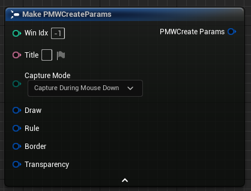

| Data              |   Type           |   Describe                                                |
|   :-:             |     :-:          |   :-                                                     |
| WinIdx            |   int32          | Create a handle index for the window, which is automatically added to the end by default  |
| Title             |   FText          |  Window title, if empty, defaults to borderless|
| CaptureMode       |EMouseCaptureMode |    Determine the mouse capture method for the window (continuous capture, mouse down capture, right mouse button capture)|
| Draw              |FPMWPainter       |    Window drawing position and size information                                 |
| Rule              |FPMWRuleParams    |    Create alignment and window type for windows                              |
| Border            |FPMWBorderParams  |    Create window border parameters                                       |
| Transparency      |FPMWOpacityParams |    Create transparent parameters for windows                                       |

 

### 1.Global Create

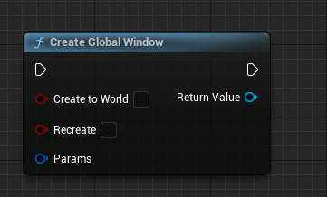

- Define parameter information to create a sub window and return the created window handle. You can define the index number of the creation window in the parameters. If it is -1, the creation will be automatically added at the end.

| Parameter            |Type              |   Describe                                                   |
|   :-:             |     :-:         |   :-                                                     |
| bCreateToWorld    |   bool          | Whether the window is bound to the world, check to destroy the window after switching scenes (handle not destroyed)  |
| bRecreate         |   bool          |  Is it necessary to recreate the window index based on the parameters passed in? If not checked, parameter modifications will be made on the window found|
| Params            |FPMWCreateParams |    Creating parameter passing determines the way the window is created                       |

 

### 2.Create By Monitor

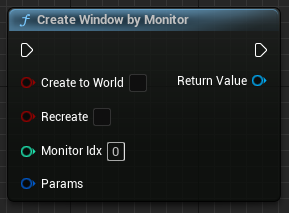

- Similar to the global creation method, but the position information filled in the drawing parameters will be converted and created based on the local coordinate system of the monitor. Added a parameter for the monitor index, which is obtained based on the index in the hardware.

| Parameter            |Type              |   Describe                                                                       |
|   :-:             |     :-:         |   :-                                                                         |
| bCreateToWorld    |   bool          | Whether the window is bound to the world, check to destroy the window after switching scenes (handle not destroyed)                       |
| bRecreate         |   bool          |  Is it necessary to recreate the window index based on the parameters passed in? If not checked, parameter modifications will be made on the window found   |
| MonitorIdx        |       int32     |    Monitor Index by hardware sort                                   |
| Params            |FPMWCreateParams |    Creating parameter passing determines the way the window is created                                           |

 

### 3.Create By Display

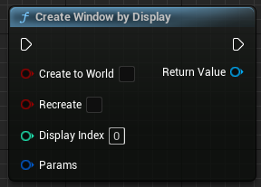

- Similar to the global creation method, but the position information filled in the drawing parameters will be converted and created based on the local coordinate system displayed by the system. Added a system display index parameter, obtained by sorting the monitor coordinates.

| Parameter            |Type              |   Describe                                                                       |
|   :-:             |     :-:         |   :-                                                                         |
| bCreateToWorld    |   bool          | Whether the window is bound to the world, check to destroy the window after switching scenes (handle not destroyed)                       |
| bRecreate         |   bool          |  Is it necessary to recreate the window index based on the parameters passed in? If not checked, parameter modifications will be made on the window found   |
| DisplayIdx        |       int32     |    Display Index sorted by monitor display rect                                    |
| Params            |FPMWCreateParams |    Creating parameter passing determines the way the window is created                                           |

 

### 4.Creat Display FullWindow

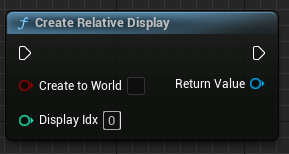

- Create a window directly into the set Display without making any other parameter selections.

| Parameter            |Type              |   Describe                                                                       |
|   :-:             |     :-:         |   :-                                                                         |
| bCreateToWorld    |   bool          | Whether the window is bound to the world, check to destroy the window after switching scenes (handle not destroyed)                       |
| DisplayIdx        |       int32     |    Display index, sort the monitor coordinates by left>top>right>bottom to obtain the monitor index, which is more convenient for determining the display position.                                    |

 

[Back To Catalog](#pp-multi-window)

 

## Create a UserWidget control handle

### 1.Create Handle By Type

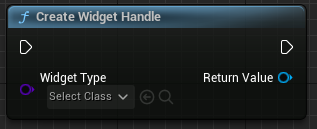

- Generate a control based on UserWidgetType and return the control handle. This control is bound to the world and will be destroyed when switching levels.

| Parameter            |Type              |   Describe                                                                       |
|   :-:             |     :-:         |   :-                                                                         |
| WidgetType        |   TSubclassOf\<UUserWidget>         | Widget Class Type                       |

 

### 2.Add Widget and return handle

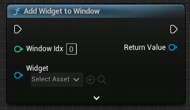

- Add an instantiated control object to a created window and return the control handle of the control. This control will not be automatically destroyed, but the handle will be automatically destroyed.

| Parameter            |Type                    |   Describe                       |
|   :-:            |     :-:                |   :-                         |
| WindowIdx        |   int32                | Window Idx                      |
| Widget           |   UUserWidget*         | Widget Object pointer           |

 

[Back To Catalog](#pp-multi-window)

 

## Window access function

### 1.Add Handle

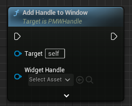

- Add the controls managed by the created control handle to the currently selected window

| Parameter            |Type                    |   Describe                       |
|   :-:            |     :-:                |   :-                         |
| WidgetHandle     |   APMWWidget*          | widget handle                  |
| ZOrder           |   int32                | z order      |

 

### 2.Remove Handle

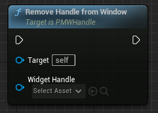

- Remove the widget managed by the created control handle from the current window

| Parameter            |Type                    |   Describe                       |
|   :-:            |     :-:                |   :-                         |
| WidgetHandle     |   APMWWidget*          | widget handle                  |

 

### 3.Add UserWidget

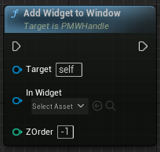

- Add the already created widget object to the current window, which is not managed by a handle

| Parameter            |Type                    |   Describe                       |
|   :-:            |     :-:                |   :-                         |
| InWidget         |   UUserWidget*         | UserWidget Object Pointer                  |
| ZOrder           |   int32                | z order      |

 

### 4.Remove UserWidget

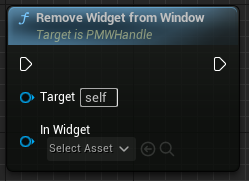

- Remove the already created widget object from the current window

| Parameter            |Type                    |   Describe                       |
|   :-:            |     :-:                |   :-                         |
| InWidget         |   UUserWidget*         | UserWidget Object Pointer                  |

 

### 5.Get Window Index

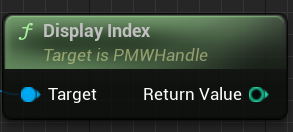

 

### 6.Check Valid

- Check if the window handle manages a valid window. If the window does not exist, return false
  
 

### 7.Bind PlayerController

- Bind the window to PlayerController. This method allows you to pass an Input Event to the currently bound PlayerController in the window. If you select Create To World during creation, it will automatically bind the PlayerController for the current level.

| Parameter                 |Type                    |   Describe                       |
|   :-:                 |     :-:                |   :-                         |
| InPlayerController    |   APlayerController*   |  Current Level PC    |
  
 

### 8.Clear PlayerController

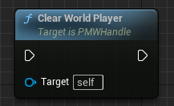

- Removing the bound PlayerController from the window can prevent input events from being received by the PlayerController.
  
 

### 9.Set Mouse Capture

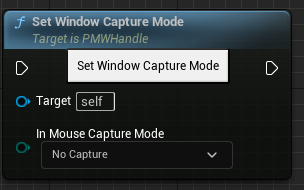

- This method simulates the capture design of GameViewportClient and determines the mouse capture method for the current window based on parameters.

| Parameter                 |Type                    |   Describe        |
|   :-:                 |     :-:                |   :-          |
| InMouseCaptureMode    |   EMouseCaptureMode   |  Mouse Capture Mode   |

 

### 10.Bind On Window Destroyed

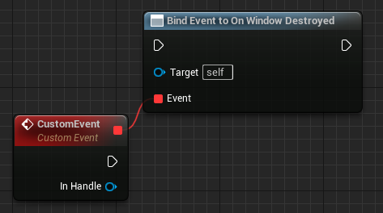

- Assign event On Window Destroyed

| Parameter                 |Type                    |   Describe        |
|   :-:                 |     :-:                |   :-          |
| InHandle    |   UPMWHandle*   |  closed window handle   |

 

[Back To Catalog](#pp-multi-window)

 

## UserWidget Control Handle

### 1.Remove From Window

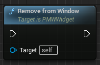

 

### 2.Get Widget

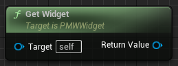

 

[Back To Catalog](#pp-multi-window)

 

## Blueprint function Libraray

### 1.Get Window Handle

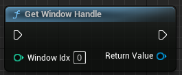

- Returns the window handle based on the window index.

| Parameter                 |Type                    |   Describe        |
|   :-:                 |     :-:                |   :-          |
| WindowIdx             |   int32                |  Returns the window handle based on the window index   |

 

### 2.Clear All Windows

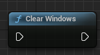

 

### 3.Close Window

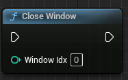

- Close Window By passed Window Index。

| Parameter                 |Type                    |   Describe        |
|   :-:                 |     :-:                |   :-          |
| WindowIdx             |   int32                |  Window Index   |

 

[Back To Catalog](#pp-multi-window)

 

## Monitor

### FPPDisplayInfo Define

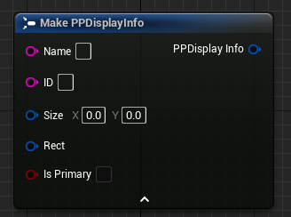

| 数据              |Type            |   Describe                    |
|   :-:             |     :-:       |   :-                      |
| Name              |   FString     |    Monitor Name                 |
| ID                |   FString     |    MonitorID                  |
| Size              |   FVector2D   |    Monitor Resolution            |
| Rect              |   FMargin     |    MonitorRect Info          |
| bIsPrimary        |   bool        |    Is Primary Monitor          |

 

### 1.Get Primary Info

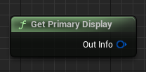

 

### 2.Get All Info

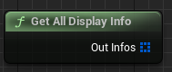

 

### 3.Get All Info By Display

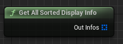

 

### 4.Get Info By Monitor Index

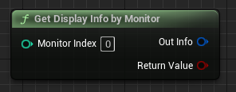

 

### 5.Get Info By Display Index

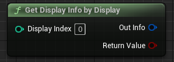

 

### 6.Get Global Rect

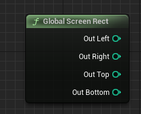

 

### 7.Monitor Global To Relative

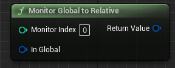

 

### 8.Monitor Relative To Global

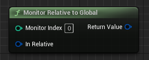

 

### 9.Display Global To Relative

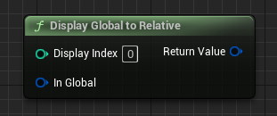

 

### 10.Display Relative To Global

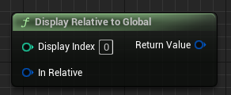

 

### 11.Format Print DisplayInfo

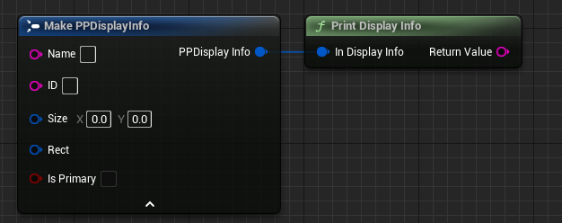

 

[Back To Catalog](#pp-multi-window)

 

## End

[Back Introduction](../main_en.md)
