# PP Multi-Window

- [PP Multi-Window](#pp-multi-window)
  - [创建窗口](#创建窗口)
    - [FPMWCreateParams 定义](#fpmwcreateparams-定义)
    - [1.根据监视器全局坐标系创建窗口](#1根据监视器全局坐标系创建窗口)
    - [2.根据监视器索引创建窗口](#2根据监视器索引创建窗口)
    - [3.根据显示设备在系统中的排序进行创建](#3根据显示设备在系统中的排序进行创建)
    - [4.创建全屏窗口到某个Display中](#4创建全屏窗口到某个display中)
  - [创建UserWidget控制句柄](#创建userwidget控制句柄)
    - [1.根据类型创建句柄](#1根据类型创建句柄)
    - [2.将已经创建的控件添加到窗口中](#2将已经创建的控件添加到窗口中)
  - [窗口操作功能](#窗口操作功能)
    - [1.将控制句柄管理的控件添加到窗口中](#1将控制句柄管理的控件添加到窗口中)
    - [2.将控制句柄管理的控件从窗口中移除](#2将控制句柄管理的控件从窗口中移除)
    - [3.直接添加某个控件到窗口中](#3直接添加某个控件到窗口中)
    - [4.将控件对象从窗口中移除](#4将控件对象从窗口中移除)
    - [5.获取窗口的索引号](#5获取窗口的索引号)
    - [6.判断窗口句柄是否有效](#6判断窗口句柄是否有效)
    - [7.绑定PlayerController](#7绑定playercontroller)
    - [8.清除PlayerController](#8清除playercontroller)
    - [9.设置窗口的鼠标捕获方式](#9设置窗口的鼠标捕获方式)
    - [10.窗口关闭事件绑定](#10窗口关闭事件绑定)
  - [UserWidget控制句柄](#userwidget控制句柄)
    - [1.将当前句柄从已经显示的窗口中移除](#1将当前句柄从已经显示的窗口中移除)
    - [2.获取句柄管理的控件对象](#2获取句柄管理的控件对象)
  - [蓝图函数库窗口方法](#蓝图函数库窗口方法)
    - [1.获取窗口句柄](#1获取窗口句柄)
    - [2.清除所有窗口](#2清除所有窗口)
    - [3.关闭窗口](#3关闭窗口)
  - [监视器相关方法](#监视器相关方法)
    - [FPPDisplayInfo 定义](#fppdisplayinfo-定义)
    - [1.获取主显示器信息](#1获取主显示器信息)
    - [2.获取所有显示器信息](#2获取所有显示器信息)
    - [3.获取根据Display排序的所有显示器信息](#3获取根据display排序的所有显示器信息)
    - [4.获取特定监视器索引的信息](#4获取特定监视器索引的信息)
    - [5.获取特定Display索引的监视器信息](#5获取特定display索引的监视器信息)
    - [6.获取全局坐标系的尺寸信息](#6获取全局坐标系的尺寸信息)
    - [7.将全局屏幕坐标系转换到监视器的局部坐标系中](#7将全局屏幕坐标系转换到监视器的局部坐标系中)
    - [8.监视器的局部坐标转换到将全局屏幕坐标系中](#8监视器的局部坐标转换到将全局屏幕坐标系中)
    - [9.将全局屏幕坐标系转换到Display的局部坐标系中](#9将全局屏幕坐标系转换到display的局部坐标系中)
    - [10.Display的局部坐标转换到将全局屏幕坐标系中](#10display的局部坐标转换到将全局屏幕坐标系中)
    - [11.格式化输出DisplayInfo](#11格式化输出displayinfo)
  - [结束](#结束)

## 创建窗口

### FPMWCreateParams 定义

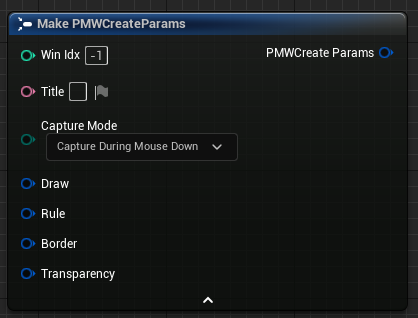

| 数据              |类型               |   说明                                                    |
|   :-:             |     :-:          |   :-                                                     |
| WinIdx            |   int32          | 创建窗口的句柄索引，默认则自动添加到末尾       |
| Title             |   FText          |  窗口标题，如果为空则默认为无边框                              |
| CaptureMode       |EMouseCaptureMode |    确定窗口的鼠标捕获方式(持续捕获、鼠标按下捕获、鼠标右键捕获)|
| Draw              |FPMWPainter       |    窗口的绘制位置和尺寸信息                                 |
| Rule              |FPMWRuleParams    |    创建窗口的对齐方式和窗口类型                              |
| Border            |FPMWBorderParams  |    创建窗口的边框参数                                       |
| Transparency      |FPMWOpacityParams |    创建窗口的透明参数                                       |

 

[返回标题](#pp-multi-window)

### 1.根据监视器全局坐标系创建窗口

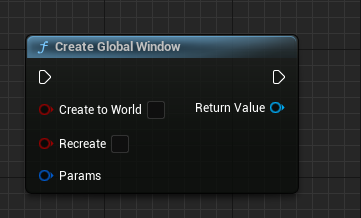

- 定义参数信息创建子窗口，并将创建的窗口句柄返回。可以在参数中定义创建窗口的索引号，如果为-1则自动在末尾新增创建。

| 参数名            |类型              |   说明                                                  |
|   :-:             |     :-:         |   :-                                                  |
| bCreateToWorld    |   bool          | 窗口是否绑定到世界，勾选则在切换场景后销毁窗口（句柄不销毁）  |
| bRecreate         |   bool          |  是否根据传入参数的窗口索引进行重新创建，如果不勾选，将会在找到窗口上进行参数修改|
| Params            |FPMWCreateParams |    创建参数传递，决定了窗口的创建方式                       |

 

[返回标题](#pp-multi-window)

### 2.根据监视器索引创建窗口

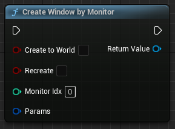

- 和全局创建方式类似，但在绘制参数填写的位置信息会基于监视器的局部坐标系进行换算创建。增加了一个监视器索引的参数，监视器索引根据硬件中的索引进行获取。

| 参数名            |类型              |   说明                                                                       |
|   :-:             |     :-:         |   :-                                                                         |
| bCreateToWorld    |   bool          | 窗口是否绑定到世界，勾选则在切换场景后销毁窗口（句柄不销毁）                       |
| bRecreate         |   bool          |  是否根据传入参数的窗口索引进行重新创建，如果不勾选，将会在找到窗口上进行参数修改   |
| MonitorIdx        |       int32     |    监视器索引号，根据硬件的索引号进行排序                                       |
| Params            |FPMWCreateParams |    创建参数传递，决定了窗口的创建方式                                           |

 

[返回标题](#pp-multi-window)

### 3.根据显示设备在系统中的排序进行创建

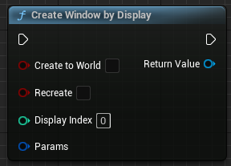

- 和全局创建方式类似，但在绘制参数填写的位置信息会基于系统显示的局部坐标系进行换算创建。增加了一个系统显示索引的参数，对监视器坐标进行排序后得到。

| 参数名            |类型              |   说明                                                                       |
|   :-:             |     :-:         |   :-                                                                         |
| bCreateToWorld    |   bool          | 窗口是否绑定到世界，勾选则在切换场景后销毁窗口（句柄不销毁）                       |
| bRecreate         |   bool          |  是否根据传入参数的窗口索引进行重新创建，如果不勾选，将会在找到窗口上进行参数修改   |
| DisplayIdx        |       int32     |    显示索引，对监视器坐标进行排序，按照左>上>右>下进行排序后获取监视器索引，更方便在确定显示位置。                                    |
| Params            |FPMWCreateParams |    创建参数传递，决定了窗口的创建方式                                           |

 

[返回标题](#pp-multi-window)

 

### 4.创建全屏窗口到某个Display中

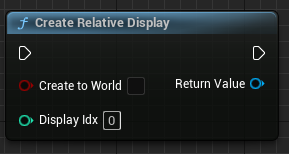

- 不进行其他参数选择，直接创建一个窗口到设定Display中

| 参数名            |类型              |   说明                                                                       |
|   :-:             |     :-:         |   :-                                                                         |
| bCreateToWorld    |   bool          | 窗口是否绑定到世界，勾选则在切换场景后销毁窗口（句柄不销毁）                       |
| DisplayIdx        |       int32     |    显示索引，对监视器坐标进行排序，按照左>上>右>下进行排序后获取监视器索引，更方便在确定显示位置。                                    |

 

[返回标题](#pp-multi-window)

 

## 创建UserWidget控制句柄

### 1.根据类型创建句柄

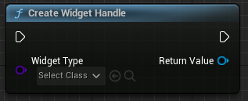

- 根据UserWidget类型生成一个控件，并且将控制句柄返回。该控件绑定在世界中，在切换关卡的时候会进行销毁处理。

| 参数名            |类型              |   说明                                                                       |
|   :-:             |     :-:         |   :-                                                                         |
| WidgetType        |   TSubclassOf\<UUserWidget>         | 控件类型                       |

 

[返回标题](#pp-multi-window)

### 2.将已经创建的控件添加到窗口中

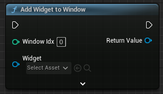

- 将已经实例化的控件对象添加到某个已经创建的窗口中，并且将控件的控制句柄返回。该控件不会自动销毁，但是句柄会自动销毁。

| 参数名            |类型                    |   说明                       |
|   :-:            |     :-:                |   :-                         |
| WindowIdx        |   int32                | 窗口索引                      |
| Widget           |   UUserWidget*         | 已经实例化的控件对象           |

 

[返回标题](#pp-multi-window)

 

## 窗口操作功能

### 1.将控制句柄管理的控件添加到窗口中

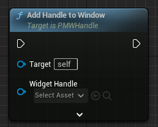

- 将已经创建的控件句柄所管理的控件添加到当前选择的窗口中

| 参数名            |类型                    |   说明                       |
|   :-:            |     :-:                |   :-                         |
| WidgetHandle     |   APMWWidget*          | 控件控制句柄                  |
| ZOrder           |   int32                | 添加的层级结构，和UMG一致      |

 

[返回标题](#pp-multi-window)

### 2.将控制句柄管理的控件从窗口中移除

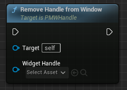

- 将已经创建的控件句柄所管理的控件从当前的窗口中移除

| 参数名            |类型                    |   说明                       |
|   :-:            |     :-:                |   :-                         |
| WidgetHandle     |   APMWWidget*          | 控件控制句柄                  |

 

[返回标题](#pp-multi-window)

### 3.直接添加某个控件到窗口中

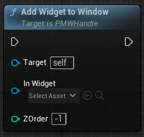

- 将已经创建的控件对象添加到当前的窗口中，该对象不受句柄管理

| 参数名            |类型                    |   说明                       |
|   :-:            |     :-:                |   :-                         |
| InWidget         |   UUserWidget*         | 控件对象指针                  |
| ZOrder           |   int32                | 添加的层级结构，和UMG一致      |

 

[返回标题](#pp-multi-window)

### 4.将控件对象从窗口中移除

- 将已经创建的控件对象从当前的窗口中移除

| 参数名            |类型                    |   说明                       |
|   :-:            |     :-:                |   :-                         |
| InWidget         |   UUserWidget*         | 控件对象指针                  |

 

[返回标题](#pp-multi-window)

### 5.获取窗口的索引号

 

[返回标题](#pp-multi-window)

### 6.判断窗口句柄是否有效

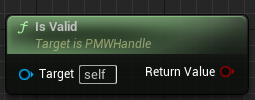

- 判断窗口句柄是否管理了有效的窗口，如果窗口不存在则返回false
  
 

[返回标题](#pp-multi-window)

### 7.绑定PlayerController

- 将窗口绑定PlayerController,使用此方法可以在窗口中传递Input Event 给当前绑定的PlayerController,如果在创建的时候选择CreateToWorld，会自动绑定当前关卡的PlayerController。

| 参数名                 |类型                    |   说明                       |
|   :-:                 |     :-:                |   :-                         |
| InPlayerController    |   APlayerController*   |  当前关卡的PlayerContoller    |
  
 

[返回标题](#pp-multi-window)

### 8.清除PlayerController

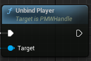

- 将已经绑定的PlayerController从窗口中移除，可以阻止窗口的输入事件被PlayerController接收到。
  
 

[返回标题](#pp-multi-window)

### 9.设置窗口的鼠标捕获方式

- 该方法模拟了GameViewportClient的捕获设计，根据参数决定当前窗口的鼠标捕获方法。

| 参数名                 |类型                    |   说明        |
|   :-:                 |     :-:                |   :-          |
| InMouseCaptureMode    |   EMouseCaptureMode   |  鼠标捕获模式   |

 

[返回标题](#pp-multi-window)

### 10.窗口关闭事件绑定

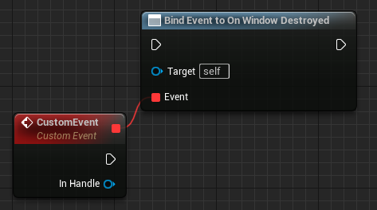

- 监听窗口关闭的事件，当窗口关闭的时候会对此进行广播。

| 参数名                 |类型                    |   说明        |
|   :-:                 |     :-:                |   :-          |
| InHandle    |   UPMWHandle*   |  传递关闭的窗口管理句柄   |

 

[返回标题](#pp-multi-window)

 

## UserWidget控制句柄

### 1.将当前句柄从已经显示的窗口中移除

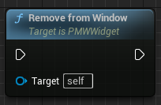

 

[返回标题](#pp-multi-window)

### 2.获取句柄管理的控件对象

 

[返回标题](#pp-multi-window)

 

## 蓝图函数库窗口方法

### 1.获取窗口句柄

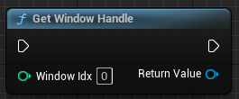

- 根据窗口索引返回窗口句柄。

| 参数名                 |类型                    |   说明        |
|   :-:                 |     :-:                |   :-          |
| WindowIdx             |   int32                |  根据窗口索引返回窗口句柄   |

 

[返回标题](#pp-multi-window)

### 2.清除所有窗口

 

[返回标题](#pp-multi-window)

### 3.关闭窗口

- 根据窗口索引关闭窗口。

| 参数名                 |类型                    |   说明        |
|   :-:                 |     :-:                |   :-          |
| WindowIdx             |   int32                |  需要关闭的窗口索引   |

 

[返回标题](#pp-multi-window)

 

## 监视器相关方法

### FPPDisplayInfo 定义

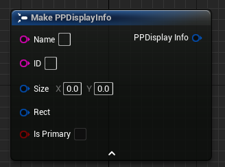

| 数据              |类型            |   说明                    |
|   :-:             |     :-:       |   :-                      |
| Name              |   FString     | 监视器名称                 |
| ID                |   FString     |  监视器ID                  |
| Size              |   FVector2D   |    监视器分辨率            |
| Rect              |   FMargin     |    监视器Rect信息          |
| bIsPrimary        |   bool        |    是否是主显示器          |

 

[返回标题](#pp-multi-window)

### 1.获取主显示器信息

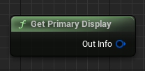

 

[返回标题](#pp-multi-window)

### 2.获取所有显示器信息

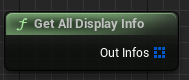

 

[返回标题](#pp-multi-window)

### 3.获取根据Display排序的所有显示器信息

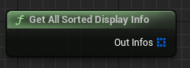

 

[返回标题](#pp-multi-window)

### 4.获取特定监视器索引的信息

 

[返回标题](#pp-multi-window)

### 5.获取特定Display索引的监视器信息

 

[返回标题](#pp-multi-window)

### 6.获取全局坐标系的尺寸信息

 

[返回标题](#pp-multi-window)

### 7.将全局屏幕坐标系转换到监视器的局部坐标系中

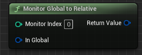

 

[返回标题](#pp-multi-window)

### 8.监视器的局部坐标转换到将全局屏幕坐标系中

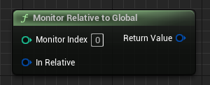

 

[返回标题](#pp-multi-window)

### 9.将全局屏幕坐标系转换到Display的局部坐标系中

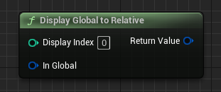

 

[返回标题](#pp-multi-window)

### 10.Display的局部坐标转换到将全局屏幕坐标系中

 

[返回标题](#pp-multi-window)

### 11.格式化输出DisplayInfo

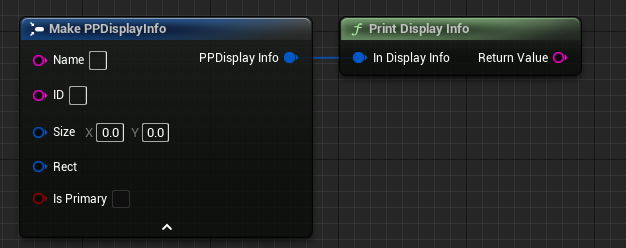

 
 

## 结束

[返回介绍](../main_zh.md)
